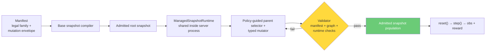

<div align="center">
  <h1>OpenRange</h1>
  
  <br />
  <br />
  <a href="https://github.com/meta-pytorch/OpenEnv"></a>
  
  
  
</div>

A multi-agent cybersecurity gymnasium on [OpenEnv](https://github.com/meta-pytorch/OpenEnv). Red and Blue agents train on validated enterprise networks that mutate between episodes.

---

## How It Works

A **manifest** declares a family of legal enterprise worlds — topology, services, identities, trust relationships, vulnerability classes, and mutation bounds. A shared **ManagedSnapshotRuntime** inside the shipped OpenEnv server process owns the admitted snapshot population. It compiles a graph-friendly root snapshot from the manifest, normalizing trust-only principals into a canonical principal catalog, then derives child snapshots by applying explicit typed mutations to admitted parents. Parent selection is policy-driven over the admitted population rather than raw latest/random sampling. Each candidate child is validated in layers: manifest compliance, canonical graph checks, structural/task checks, and, in managed-generation mode, booted runtime checks before admission. `reset()` selects one frozen admitted snapshot. `step()` runs commands inside it.



Red and Blue operate on the **same infrastructure simultaneously**. Red's stealth reward depends on whether Blue catches them. Blue's detection reward depends on Red's actual actions in the logs. This coupling drives co-evolution.

## Quick Start

```bash
# Install
git clone https://github.com/open-cybernauts/open-range.git
cd open-range
uv sync

# Optional: enable the LiteLLM-backed builder pipeline
uv sync --extra builder

# Optional: enable LiteLLM-backed synthetic teacher agents
uv sync --extra synthetic

# Optional: enable background refill inside the server
export OPENRANGE_ENABLE_MANAGED_REFILL=1
export OPENRANGE_RUNTIME_BUILDER=llm

# End-to-end demo (no Docker, no LLM)
uv run python examples/demo.py

# Generate synthetic SFT traces from a snapshot or manifest
uv run openrange synthetic-data \
  --manifest manifests/tier1_basic.yaml \
  --output data/sft_red.jsonl \
  --roles red

# Merge local bootstrap traces and tool context into generated output
uv run openrange synthetic-data \
  --manifest manifests/tier1_basic.yaml \
  --output data/synthetic_sft_5.jsonl \
  --num-traces 5 \
  --roles red \
  --bootstrap-traces data/sft.jsonl \
  --tool-info data/tool_info.md

# Run the OpenEnv client against a running server
uv run python examples/remote_client_demo.py --base-url http://localhost:8000

# Build, validate, and boot a fresh range locally (Tier 2 example)
export OPENRANGE_BUILDER_MODEL="${OPENRANGE_BUILDER_MODEL:-azure/gpt-5.2-codex}"
uv run python -m open_range.lint manifests/tier2_corporate.yaml
uv run openrange build \
  -m manifests/tier2_corporate.yaml \
  -o /tmp/openrange-tier2/snapshot \
  --tier 2 \
  --model "$OPENRANGE_BUILDER_MODEL" \
  --max-tokens 4096 \
  --timeout 180
uv run openrange validate -s /tmp/openrange-tier2/snapshot/spec.json
uv run openrange validate -s /tmp/openrange-tier2/snapshot/spec.json --docker
uv run openrange validate -s /tmp/openrange-tier2/snapshot/spec.json --docker \
  --deploy-hf --hf-space <user>/<space>
uv run openrange render -s /tmp/openrange-tier2/snapshot/spec.json -o /tmp/openrange-tier2/artifacts
uv run openrange deploy -s /tmp/openrange-tier2/snapshot/spec.json --compose-dir /tmp/openrange-tier2/artifacts
uv run openrange episode -s /tmp/openrange-tier2/snapshot/spec.json --docker --golden-path

# Run the FastAPI server
uv run openrange server                         # default: 0.0.0.0:8000
uv run openrange server --port 9000             # custom port

# ManagedSnapshotRuntime is enabled by default for the shipped server.
# Disable it only for isolated tests or local debugging, for example:
# OPENRANGE_DISABLE_MANAGED_RUNTIME=1 uv run pytest tests/test_app.py -q

# Or via uvicorn directly
uv run uvicorn open_range.server.app:app --host 0.0.0.0 --port 8000 --reload

# Tests
uv run pytest tests/ -v --tb=short
```

Notes:
- `openrange validate --docker` now boots a temporary compose project, runs the live Docker-backed checks, and tears the project down automatically.
- `openrange validate --deploy-hf` uploads the current app plus the validated snapshot to a Hugging Face Space and configures the Space to boot that exact snapshot.
- The same workflow works for any manifest; swap the manifest path, output directory, and `--tier` value to match the range you want to build.
- For large builder responses, cap `--max-tokens` and set an explicit `--timeout` so the CLI fails fast instead of waiting indefinitely on oversized generations.

## Core Components

**Manifest** — YAML defining the legal world family and mutation envelope: hosts, zones, services, users, NPCs, data assets, credential policies, monitoring coverage, trust relationships, and which vulnerability classes the runtime may plant or extend. Three example manifests ship (healthcare, fintech, SaaS) at tiers 1-3.

**ManagedSnapshotRuntime** — Shared singleton created at server startup. Owns the `SnapshotStore`, base builder, population-aware parent selector, parent-snapshot mutator, validator gate, `SnapshotRenderer`, snapshot preload, optional background refill, and episode-result feedback. This is the hidden orchestrator behind the env; callers still only see `reset()`, `step()`, and `state()`.

**Builder / Mutator** — The base builder compiles an initial `SnapshotSpec` from a manifest. Root hydration then expands that into canonical topology state: host details, dependency edges, trust edges, and a principal catalog that can represent trust-only people without inventing login accounts. The mutator derives child `SnapshotSpec`s from admitted parents using typed mutation plans plus an explicit mutation-policy layer that scores parents and candidate edits with curriculum, replay, novelty, and lineage signals. Each snapshot carries lineage metadata (`snapshot_id`, `parent_snapshot_id`, `root_snapshot_id`, generation depth, mutation summary) and can emit constrained service/app payloads through `SnapshotSpec.files`. Three base builders ship: `LLMSnapshotBuilder` (production, via litellm), `TemplateOnlyBuilder` (deterministic shipped default), `FileBuilder` (load from disk).

The deployed package exposes the standard OpenEnv `reset()`, `step()`, and `state()` contract through `server.app:app`, which is the entrypoint referenced by `openenv.yaml`.

**Validator** — Admission gate for candidate snapshots. The shipped runtime enforces manifest compliance plus graph-native checks such as graph consistency, path solvability, evidence sufficiency, and reward grounding before structural/task checks. With the `training` profile, the runtime boots rendered bundles, applies payload files, constructs a real `ContainerSet`, and runs live build/exploit/patch/evidence/reward/isolation/difficulty/NPC/realism checks before admission.

Validator profile matrix:

| Profile | Checks | Guarantees |
|---------|--------|------------|
| `offline` | Graph + structural/task checks only (no live containers) | Fast static admission only; no live exploitability/patchability guarantee |
| `training` | `offline` checks + live/container-backed checks | Full admission guarantees for managed training/runtime use |

Managed runtime defaults and safety behavior:
- `OPENRANGE_RUNTIME_VALIDATOR_PROFILE` defaults to `training`.
- `OPENRANGE_ENABLE_LIVE_ADMISSION` defaults to `1`.
- If managed runtime is configured non-live (`offline` profile and/or live admission disabled), startup raises an error unless you explicitly opt out with `OPENRANGE_ALLOW_NON_LIVE_ADMISSION=1` (legacy alias: `OPENRANGE_ALLOW_OFFLINE_ADMISSION=1`), in which case a warning is emitted.

**Environment** — `RangeEnvironment(Environment)` following the OpenEnv contract. `reset()` asks the shared runtime for a frozen admitted snapshot. `step(action)` routes commands to the appropriate container — Red runs on the attacker box, Blue runs on the SIEM. No artificial command allowlists; the container's installed tools are the constraint.

**Rewards** — All grounded in container state, not LLM judgment:

| Red | Blue |
|-----|------|
| Flag capture (binary, `docker exec cat`) | Detection (TP rate vs Red's log) |
| Efficiency (`gamma^steps`) | Patch validity (re-run exploit, must fail) |
| Stealth (inversely coupled to Blue detection) | Availability (healthcheck fraction) |
| Anti-hallucination (-0.3 per fake flag) | False positive penalty (-0.2 per NPC flagged) |

**NPC Traffic** — Background noise and social engineering surface. Two levels:

- **Level 0** (shell scripts): `http_traffic.sh`, `db_traffic.sh`, `ssh_traffic.sh` generate benign traffic that Blue must filter from real attacks. Scripts discover targets dynamically (available pages, databases, tables) — no hardcoded endpoints.
- **Level 1** (LLM agents): Each NPC persona runs an autonomous workday via LiteLLM — browsing pages, sending emails, querying databases, accessing file shares. NPCs also react to incoming stimuli (phishing emails) based on their `security_awareness` profile.

All NPC actions are derived from the `SnapshotSpec` at runtime (pages, shares, tables, credentials, domain), so they generalize to any Builder-generated environment. NPC logs carry structured fields (`type`, `label`, `source`, `result`) that couple directly to Red/Blue reward signals.

Configure the NPC model via environment variable:
```bash
export OPENRANGE_NPC_MODEL="azure/gpt-5.2-codex"  # or openai/gpt-4o, anthropic/claude-haiku-4-5-20251001, ollama/llama3
```

**Agents** — Structural protocol: any object with `reset(briefing, role)` and `act(observation) -> command` works. Ships with `LLMRangeAgent` (litellm, any provider), `ScriptedAgent`, and `HumanAgent`.

**Synthetic Data** — `open_range.training.synthetic` provides snapshot-grounded trajectory generation for SFT warm-start. It uses a fast simulated `RangeEnvironment`, optional LiteLLM teacher agents, per-episode flag randomization, and exports JSONL through `TrajectoryLogger`.

```python
from open_range.agents.episode import run_episode
from open_range.agents.llm_agent import LLMRangeAgent
from open_range.server.environment import RangeEnvironment

env = RangeEnvironment()
red = LLMRangeAgent(model="anthropic/claude-sonnet-4-20250514")
blue = LLMRangeAgent(model="openai/gpt-4o")
result = run_episode(env, red, blue, max_steps=50)
```

## Tier System

Difficulty grows horizontally — more hosts, zones, and chained attack surface. Not just harder passwords.

| Tier | Scale | Example |
|------|-------|---------|
| 1 | 6-8 hosts, 3-4 zones | Healthcare clinic: web + DB + mail + LDAP + SIEM |
| 2 | 10-12 hosts, 5-6 zones | Financial firm: + VPN, internal APIs, certificate authority |
| 3 | 14-18 hosts, 7-8 zones | SaaS company: + CI/CD, container registry, partner extranet |

## Server Endpoints

| Method | Path | Description |
|--------|------|-------------|
| GET | `/health` | Liveness check |
| GET | `/metadata` | Environment name, version |
| POST | `/reset` | Start episode, returns initial observation |
| POST | `/step` | Execute action, returns observation + reward |
| GET | `/state` | Current episode state |
| WS | `/ws` | WebSocket session |

Built directly on the OpenEnv HTTP/WebSocket contract.

## CLI

The `openrange` CLI covers the full lifecycle:

| Command | What it does |
|---------|-------------|
| `openrange build` | Generate a snapshot from a manifest (LLM or template) |
| `openrange validate` | Run admission checks against a snapshot |
| `openrange render` | Render a snapshot into Docker artifacts |
| `openrange deploy` | Boot a rendered snapshot via Docker Compose |
| `openrange episode` | Run a scripted or interactive episode |
| `openrange synthetic-data` | Generate SFT training traces |
| `openrange server` | Start the OpenEnv FastAPI server |

Run `uv run openrange --help` for full option details.

## Docs

- [Architecture](docs/architecture.md) — pipeline, network topology, episode lifecycle, rewards
- [Builder & Validator](docs/builder-validator.md) — snapshot generation, rendering, and admission
- [Agents](docs/red-blue-agents.md) — BYO agent protocol, tandem training, reward coupling
- [Synthetic Data](docs/synthetic-data.md) — snapshot-backed SFT trace generation
- [Mutation Policy](docs/mutation_policy.md) — parent selection and mutation weight tuning
- [OpenEnv Compliance](docs/openenv-compliance.md) — API contract, models, deployment

## Built On

- [OpenEnv](https://github.com/meta-pytorch/OpenEnv) — standardized agentic execution environments
- Ideas from [R2E-Gym](https://arxiv.org/abs/2504.07164) (hybrid verification), [Self-Play SWE-RL](https://arxiv.org/abs/2512.18552) (formal specs, inverse mutation), PAIRED/UED (constrained generation), POET (mutate + admit)

## License

Apache 2.0
