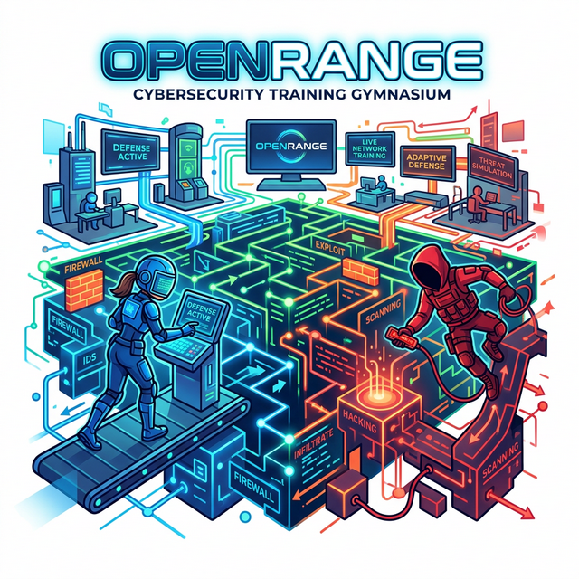
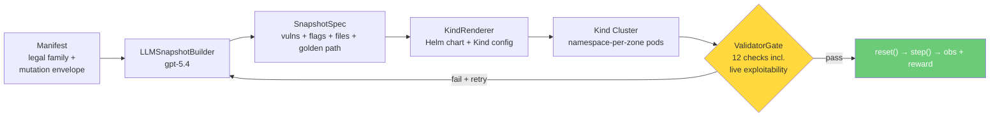

<div align="center">
  <h1>OpenRange</h1>
  
  <br />
  <br />
  <a href="https://github.com/meta-pytorch/OpenEnv"></a>
  
  
  
</div>

## Context
Reinforcement learning has produced breakthroughs in games, robotics, and code generation — each powered by a high-quality training environment (MuJoCo, SWE-bench, Atari). Cybersecurity has no equivalent. Offensive and defensive skills require multi-host enterprise networks with real services, real protocols, and realistic user traffic — none of which exist in current benchmarks.

## Problem
The closest alternatives — static CTF challenges — are hand-authored, single-exploit puzzles that don't scale. They lack background traffic, ignore the defensive side entirely, and present the same challenge on every reset. Agents trained on them memorize specific exploit sequences instead of learning transferable skills. You cannot do meaningful RL when the environment never changes.

## Solution
OpenRange procedurally generates full enterprise networks — web servers, databases, mail, LDAP, firewalls, SIEM — using an LLM-driven Builder, then mechanically validates every generated environment before an episode starts. The environment mutates on each reset, so no two episodes are alike. Red and Blue agents train simultaneously on the same live infrastructure with coupled reward signals: Red's stealth score depends on Blue's detection, and vice versa. This creates the adversarial pressure needed to drive real skill acquisition in both directions.

## Key Capabilities

|  | Static CTFs (Before) | OpenRange (After) |
|--|---------------------|-------------------|
| **Environment** | Hand-authored, fixed topology | Procedurally generated enterprise networks that mutate every episode |
| **Diversity** | Same challenge on every reset | Unique vulnerability chains, injection points, and network layouts per episode |
| **Validation** | Manual / honor system | 12-check mechanical pipeline verifies exploitability, patchability, and isolation before any episode runs |
| **Realism** | No background traffic | NPCs run web queries, database transactions, and emails — Blue must filter signal from noise |
| **Defense** | Not supported | Blue agent trains simultaneously, with rewards coupled to Red's actions |
| **Rewards** | Binary (solved / not solved) | Grounded in pod state: flag capture, patch validity, stealth, availability — no LLM judgment |
| **Scale** | One challenge at a time | Continuous generation of novel Kubernetes environments via LLM Builder |

## How It Works

A **manifest** declares a family of legal enterprise worlds — topology, services, identities, trust relationships, vulnerability classes, and mutation bounds. The **LLMSnapshotBuilder** calls an LLM (e.g., `gpt-5.4`) to generate a complete `SnapshotSpec` — a multi-page PHP web application with planted vulnerabilities, database seed SQL, file share documents, NPC personas, and golden path exploit chains. 

The **KindRenderer** then produces a Helm chart with namespace-per-zone isolation (NetworkPolicies replacing iptables), ConfigMap-injected payloads, and ExternalName services for cross-namespace DNS. The **ValidatorGate** runs 12 admission checks — 7 offline graph checks plus 5 live checks that `kubectl exec` into the pods to verify the golden path is actually exploitable.



Red and Blue operate on the **same infrastructure simultaneously**. Red's stealth reward depends on whether Blue catches them. Blue's detection reward depends on Red's actual actions in the logs. This coupling drives co-evolution.

**Example End-to-End Result (`tier1_basic.yaml`):**

| Component | Detail |
|-----------|--------|
| LLM Build | 3 vulns (sqli, weak_creds, missing_authz), 2 flags, 6 golden path steps, 18 files, 8 NPCs |
| Deploy | 7 pods across 4 namespaces in 10s, attacker tools ready in 30s |
| Network | 14 NetworkPolicies (namespace-per-zone), 18 ExternalName DNS aliases |
| Validation | **12/12 checks pass** including live SQLi execution from attacker pod |

## Quick Start

### 1. Installation

```bash
git clone https://github.com/open-cybernauts/open-range.git
cd open-range
uv sync

# Optional: Enable the LiteLLM-backed builder pipeline
uv sync --extra builder
```

### 2. Run an Interactive Demo
Test the core mechanics locally without Kubernetes or LLMs:
```bash
uv run python examples/demo.py
```

### 3. Spin up an Environment (Kind / Kubernetes)
To build, validate, and boot a full Red vs Blue sandbox locally on Kind:
```bash
# Prerequisites: Docker, Kind, Helm, kubectl

# 1. Build a local snapshot from a manifest
export OPENRANGE_BUILDER_MODEL="openai/gpt-5.4"
uv run openrange build -m manifests/tier1_basic.yaml -o /tmp/snapshot --tier 1

# 2. Render Helm chart and Validate
uv run openrange render -s /tmp/snapshot/spec.json -o /tmp/artifacts
uv run openrange validate -s /tmp/snapshot/spec.json 

# 3. Deploy to Kind
uv run openrange deploy -s /tmp/snapshot/spec.json

# 4. Start the FastAPI server
uv run openrange server  # Runs on 0.0.0.0:8000
```

## Kubernetes Architecture

The range deploys to Kind with **namespace-per-zone** isolation:

| Zone | Namespace | Pods | Role |
|------|-----------|------|------|
| external | `openrange-external` | attacker | Red team operator (nmap, curl, sqlmap, hydra) |
| dmz | `openrange-dmz` | web, mail | Internet-facing services (PHP app, SMTP/IMAP) |
| internal | `openrange-internal` | db, files | Data tier (MySQL, Samba shares) |
| management | `openrange-management` | ldap, siem | Identity + monitoring (OpenLDAP, syslog-ng) |

**Key design decisions:**
- **NetworkPolicies** replace iptables (default-deny + allow-same-zone + cross-zone firewall rules from manifest)
- **ExternalName services** in every namespace so bare hostnames (`web`, `db`) resolve anywhere — the attacker can `curl http://web/` without full DNS
- **ConfigMaps** inject all payload files (PHP code, SQL seeds, configs, flag files) via `subPath` volume mounts
- **Base DB schema** runs as `00-base-schema.sql`; LLM SQL runs as `99-openrange-init.sh` with `mysql --force` to tolerate minor LLM errors
- **Golden path post-processing** fixes URL encoding (`%25'`→`%27`), encodes spaces in SQL payloads, and wraps `grep` with `|| true`

## Validator Pipeline

12 admission checks — 7 offline graph checks + 5 live container checks:

| # | Check | Type | What it verifies |
|---|-------|------|-----------------|
| 1 | manifest_compliance | offline | Topology matches manifest hosts/zones |
| 2 | graph_consistency | offline | Hosts, users, principals, edges are consistent |
| 3 | path_solvability | offline | All vuln/flag hosts reachable from attacker via graph edges |
| 4 | graph_evidence_sufficiency | offline | Evidence locations grounded in graph |
| 5 | graph_reward_grounding | offline | Flags linked to vulns, rewards computable |
| 6 | task_feasibility | offline | Briefings present and non-leaking |
| 7 | difficulty | offline | Golden path step count within tier range (T1: 6-10) |
| 8 | build_boot | live | All pods Running + Ready (firewall skipped — K8s virtual host) |
| 9 | exploitability | live | Execute golden path end-to-end via `kubectl exec` in attacker pod |
| 10 | evidence | live | Evidence artifacts exist at declared locations |
| 11 | reward_grounding | live | Flag capture produces correct reward signal |
| 12 | isolation | live | Zone isolation enforced, no cross-zone leakage |

## Core Components

| Component | What it does |
|-----------|-------------|
| **Manifests** | Declarative YAML blueprints that define valid enterprise topologies — hosts, zones, services, users, and allowed vulnerability classes. Ships with healthcare, fintech, and SaaS examples at tiers 1–3. |
| **Builder / Mutator** | LLM-driven agent (via [LiteLLM](https://github.com/BerriAI/litellm)) that generates a unique `SnapshotSpec` and mutates the environment on each `reset()` using curriculum feedback from prior episodes. |
| **KindRenderer** | Produces a Helm chart (`values.yaml` from SnapshotSpec + static Go templates) and Kind cluster config. Namespace-per-zone, NetworkPolicies, ConfigMap payloads, ExternalName DNS aliases. |
| **HelmRunner** | `helm upgrade --install` / `helm uninstall` for lifecycle. `KubePodSet` provides `exec()`, `is_healthy()`, `cp()`, `restart()` via `kubectl`. |
| **ValidatorGate** | Mechanical admission controller running the 12-check test pipeline to ensure exploitability, graph coherence, and isolation. |
| **Environment** | `RangeEnvironment(MCPEnvironment)` following the OpenEnv contract. `reset()` selects a frozen admitted snapshot. `step(action)` routes commands to live SIEM / attacker pods. |
| **Rewards** | Fully grounded in container state. Red is scored on flag capture (`kubectl exec`), efficiency, and stealth. Blue is scored on detection accuracy, patch validity, and service availability. No LLM judgment involved. |
| **NPC Traffic** | Background noise engine generating benign shell-script HTTP/DB patterns or full LLM-driven NPC agents with autonomous workday loops and stimulus-responses. |
| **Agents** | BYO protocol — implement `reset()` and `act()`. Ships with `LLMRangeAgent` (any LiteLLM model), `ScriptedAgent` (testing), and `HumanAgent` (interactive). |

### Example

```python
from open_range.agents.episode import run_episode
from open_range.agents.llm_agent import LLMRangeAgent
from open_range.server.environment import RangeEnvironment

env = RangeEnvironment()
red = LLMRangeAgent(model="anthropic/claude-opus-4-6-20260301")
blue = LLMRangeAgent(model="openai/gpt-5.4")
result = run_episode(env, red, blue, max_steps=50)
```

## Tier System

| Tier | Scale | Steps | Example |
|------|-------|-------|---------|
| 1 | 6-8 hosts, 3-4 zones | 6-10 | Healthcare clinic: web + DB + mail + LDAP + SIEM |
| 2 | 10-12 hosts, 5-6 zones | 12-18 | Financial firm: + VPN, jumpbox, internal APIs |
| 3 | 14-18 hosts, 7-8 zones | 20-30 | SaaS company: + CI/CD, container registry, partner extranet |

## Server Endpoints

| Method | Path | Description |
|--------|------|-------------|
| GET | `/health` | Liveness check |
| GET | `/metadata` | Environment name, version |
| POST | `/reset` | Start episode, returns initial observation |
| POST | `/step` | Execute action, returns observation + reward |
| GET | `/state` | Current episode state |
| WS | `/ws` | WebSocket session |

## CLI

| Command | What it does |
|---------|-------------|
| `openrange build` | Generate a snapshot from a manifest (LLM or template) |
| `openrange validate` | Run admission checks against a snapshot |
| `openrange render` | Render a snapshot into a Helm chart + Kind config |
| `openrange deploy` | Deploy to Kind cluster via Helm |
| `openrange episode` | Run a scripted or interactive episode |
| `openrange synthetic-data` | Generate SFT training traces |
| `openrange server` | Start the OpenEnv FastAPI server |

## Docs

- [Architecture](docs/architecture.md) — pipeline, network topology, episode lifecycle, rewards
- [Builder & Validator](docs/builder-validator.md) — snapshot generation, rendering, and admission
- [Agents](docs/red-blue-agents.md) — BYO agent protocol, tandem training, reward coupling
- [Synthetic Data](docs/synthetic-data.md) — snapshot-backed SFT trace generation
- [Mutation Policy](docs/mutation_policy.md) — parent selection and mutation weight tuning
- [OpenEnv Compliance](docs/openenv-compliance.md) — API contract, models, deployment

## Built On

- [OpenEnv](https://github.com/meta-pytorch/OpenEnv) — standardized agentic execution environments
- Ideas from [R2E-Gym](https://arxiv.org/abs/2504.07164) (hybrid verification), [Self-Play SWE-RL](https://arxiv.org/abs/2512.18552) (formal specs, inverse mutation), PAIRED/UED (constrained generation), POET (mutate + admit)

## License

Apache 2.0
